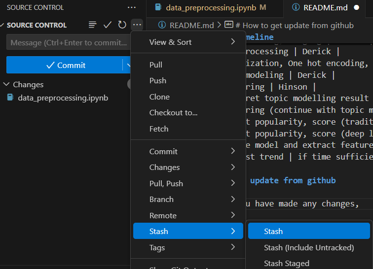
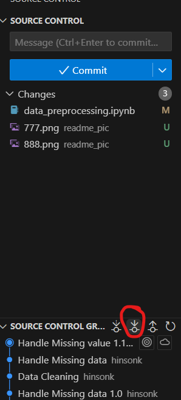
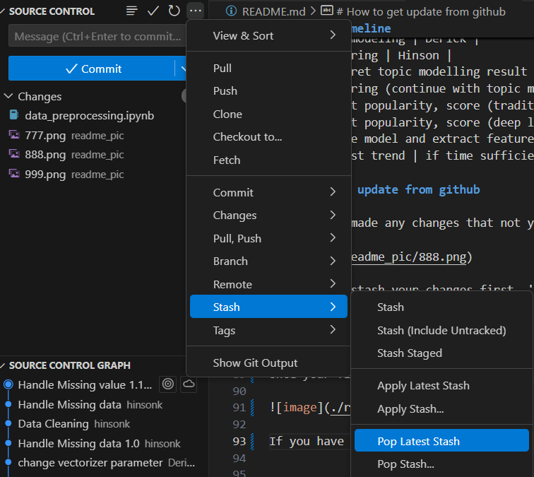
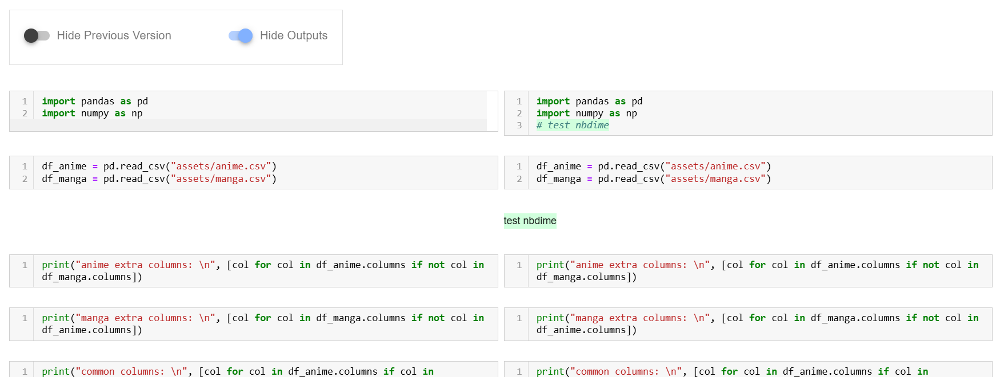

# Virtual Environment Setup Guide

This guide explains how to set up a virtual environment, install necessary libraries, and keep the environment up to date using `requirements.txt`.

## **1. Initial Setup**

### 1.1 Create the Virtual Environment
In VS code, press ctrl + ` to open a terminal. Make sure you are in your project directory.

Run:
```bash
python -m venv env696
```
### 1.2 Activate the Virtual Environment
```bash
env696\Scripts\activate
```
### 1.3 Install Required Libraries
Use the requirements.txt file to install libraries:
```bash
pip install -r requirements.txt
```
## **2. Working with the Virtual Environment in VScode Jupyter**
### 2.1 Every Time You Start Working
Activate the virtual environment in VScode jupyter:

Press this button:


Change to `env696`:


Verify activation by running this in jupyter:
```bash
!where python
```
The first path should be within `env696`.
### 2.2 When There Are Changes to `requirements.txt`
Run:
```bash
pip install -r requirements.txt
```

### 2.3 Every Time You Install or Update a Library
Export to the `requirements.txt`:
```bash
pip freeze > requirements.txt
```
If your code require downloaded model, add the download command near that block.


## 3. Notes
`env696` folder is created under the project folder, but it will not upload to github, as I include `.gitignore` to tell git to ignore this folder.

If you encounter any issues or want to start fresh:
1. Manually delete the `env696` folder.
2. Recreate the environment by following step 1 again.

# How to get update from github

If you have made any changes that not yet commit, which means there is an 'M' near the file name,


you need to stash your changes first. 'Stash' means you create a temporary place to hold your changes, so that the changes you are pulling will not conflict with your current changes.



Once your files are cleaned to pull, click the pull button



If you have stashed your changes, you can get back those changes by the 'pop latest stash'



# How to view diffs

- view diffs for current commit (before you push):
  
  In VScode, save the notebook and click the arrow surround button
  
  
  
  

- view diffs for all previous commit:
  
  VScode don't have good support for viewing jupyter diffs 
  

  So, use third party website, provide user friendly view:
  https://app.reviewnb.com/derickkan3356/696/
  


