# Exploring Factors Influencing the Success of Anime Using Machine Learning

**Table of Content:**
- [Introduction](#introduction)
    - [Main Findings](#main-findings)
- [Data Source and Feature Engineering](#data-source-and-feature-engineering)
    - [Data Source](#data-source)
    - [Key Columns for Analysis](#key-columns-for-analysis)
    - [Combining Anime and Manga Datasets](#combining-anime-and-manga-datasets)
    - [Resulting Dataset and Data Types](#resulting-dataset-and-data-types)
    - [Data Splitting](#data-splitting)
    - [Separate Processing for Traditional Machine Learning and Deep Learning](#separate-processing-for-traditional-machine-learning-and-deep-learning)
        - [Traditional Machine Learning](#traditional-machine-learning)
        - [Deep Learning](#deep-learning)
- [Unsupervised Learning](#unsupervised-learning)
    - [Motivation](#motivation)
    - [Methodology](#methodology)
        - [Text Pre-processing](#text-pre-processing)
        - [Evaluation and Selection of the Best Approach](#evaluation-and-selection-of-the-best-approach)
        - [Deep Dive into BERTopic](#deep-dive-into-bertopic)
    - [Results and Evaluation of Final Topic Model](#results-and-evaluation-of-final-topic-model)
        - [Topic Assignments and Theme Labelling](#topic-assignments-and-theme-labelling)
        - [Topic Distribution](#topic-distribution)
        - [Topic Scores Distribution](#topic-scores-distribution)
        - [Sensitivity Analysis](#sensitivity-analysis)
- [Supervised Learning](#supervised-learning)
    - [Methodology](#methodology-1)
        - [Model Training and Fine-Tuning](#model-training-and-fine-tuning)
        - [Summary of Training Procedure](#summary-of-training-procedure)
    - [Evaluation](#evaluation)
        - [Feature Analysis](#feature-analysis)
        - [Learning Curve Analysis](#learning-curve-analysis)
        - [Hyperparameter Sensitivity Analysis](#hyperparameter-sensitivity-analysis)
        - [Residual Analysis](#residual-analysis)
- [Discussion](#discussion)
    - [Supervised Learning](#supervised-learning-1)
    - [Unsupervised Learning](#unsupervised-learning-1)
- [Repository Overview](#repository-overview)

## Introduction
The main problem we are attempting to solve is twofold: (1) to derive a **single thematic label** for each anime and manga title based on the title and synopsis using **unsupervised learning** techniques, and (2) to **understand the factors** that contribute to the success of these titles by **predicting the user-rated scores** on [MyAnimeList](https://myanimelist.net/). By solving these problems, we hope to provide a general framework for understanding how thematic content influences user engagement and success metrics in creative industries. This approach could be applied to various domains beyond anime and manga, helping content creators, marketers, and platform owners make data-driven decisions to better align with audience preferences and improve content development.

The motivation for this project stems from the growing interest in anime and manga as a form of entertainment worldwide, as well as the curiosity to understand the drivers behind highly rated titles. As the anime and manga industry continues to expand globally, understanding the nuances of what appeals to audiences can significantly impact how content is produced and marketed.

In this project, we employ both **supervised and unsupervised learning** techniques to address our research question. The unsupervised part involves applying **topic modeling** to derive a single thematic label for each anime or manga based on the **title and synopsis**. This helps in categorizing the content into **meaningful themes**, thus providing an enriched set of features for our downstream supervised learning tasks. The supervised learning part utilizes all available features, including those derived from topic modeling, to **predict the user rating score** on MyAnimeList. 

### Main Findings
From the unsupervised learning approach, we derived **9 distinct themes** for anime and manga titles. A significant proportion of the content falls into 'High School Life and Romance' and 'Fantasy Adventure / Isekai (alternate world)', which aligns well with the popular trends observed in Japanese anime and manga culture.

Our supervised learning model achieved a **root mean square error (RMSE)** of **0.630**, which is relatively strong considering the 10-point scale used for scoring. The feature importance analysis using SHAP revealed that **creators** is the most influential feature on user score. **popularity-related features**, such as 'favorites', 'members', and 'scored_by', are **highly positively associated with user scores**.

## Data Source and Feature Engineering
### Data Source
The dataset used in this project was downloaded from [Kaggle](https://www.kaggle.com/datasets/andreuvallhernndez/myanimelist/data). It was extracted from [MyAnimeList](https://myanimelist.net/) as of August 7, 2023. There are two datasets: Anime and Manga. The Anime dataset contains 24,985 entries and 39 features, while the Manga dataset contains 64,833 entries and 30 features.

### Key Columns for Analysis
For our analysis, the following key columns were used:
- `title_english`: The English title, which was used for topic modeling.
- `title_japanese`: The original language title, primarily Japanese, which was used to identify familiar titles during topic modeling evaluation.
- `synopsis`: A brief description, used for topic modeling.
- `score`: The rating score given by MyAnimeList users, used for supervised learning.

These columns are crucial for our analysis. We decided to drop all entries with missing values in these key columns. Additionally, we removed any columns that were either not useful for our analysis or duplicates of other columns.

### Combining Anime and Manga Datasets
While there are numerous common columns between the Anime and Manga datasets, some are unique to each dataset:
- Anime extra columns: episodes, source, studios, producers
- Manga extra columns: chapters, authors, serializations

Since the two datasets share similar behaviours, we decided to combine these columns as follows:
| Anime Columns | Manga Columns    | Resulting Column                  |
|---------------|------------------|-----------------------------------|
| episodes      | chapters         | episodes/chapters                 |
| source        | NULL             | impute constant 'Missing' for Manga |
| studios       | authors          | creators                          |
| producers     | serializations   | production_source                 |

We also added an additional column called `is_anime` to indicate if an entry originally came from the Anime dataset.

After combining the Anime and Manga datasets, we extracted the year and season from both the `start_date` and `end_date` columns. This was done to replace the original `start_year` and `start_season` columns, which had a significantly higher proportion of missing values compared to `start_date`. Moreover, using the season as a feature aligns well with the anime industry culture, as many anime titles are released according to seasonal schedules.
Additionally, we extracted author names from dictionaries into strings. For example, we transformed `{'id': 1868, 'first_name': 'Kentarou', 'last_name': 'Miura', 'role': 'Story & Art'}` to `Kentarou Miura`.

### Resulting Dataset and Data Types
After all the above processing, 24,309 entries are left. Below is a summary of the resulting dataset's columns:
- Text columns: `title_english`, `title_japanese`, `synopsis`
- Numerical columns: `score`, `score_by`, `episodes/chapters`, `members`, `favorites`
- Single-label categorical columns: `type¸` `status`, `source`
- Multi-label categorical columns: `genres`, `themes`, `demographics`, `creators`, `production_source`
- Boolean columns: `sfw`, `is_anime`

### Data Splitting
Following these pre-processing steps, we randomly split the dataset into training and test sets with ratio 8:2. From this point forward, all fitting will be performed only on the training set, and the same transformations will be applied to the test set. **This practice is maintained throughout the entire project**, including normalization, encoding, imputation, embedding, topic modelling, and supervised learning.

### Separate Processing for Traditional Machine Learning and Deep Learning
The feature engineering process differs slightly depending on whether the features are used for traditional machine learning models or deep learning models:

#### Traditional Machine Learning
1. **Multi-Label Encoding:** We used `MultiLabelBinarizer` from Scikit-learn to encode multi-label categorical columns.
2. **Dimensionality Reduction:** We applied truncated SVD with a constant 5 dimensions on each of the encoded multi-label columns. This fixed dimensionality helps avoid bias toward columns with more labels.
3. **Single-Label Encoding and Scaling:** We filled missing values in single-label categorical columns with 'Missing' and used `OneHotEncoder` for encoding. Numerical features were scaled using `StandardScaler`.
4. **Imputation:** We used a KNN imputer to impute all other missing values.

#### Deep Learning
1. **Handle Missing Values:** Missing values in single categorical columns were filled with 'Missing'.
2. **Label Encoding:** Both single-label and multi-label categorical columns were label-encoded.
3. **Padding:** Multi-label categorical columns were padded with zeros after label encoding.
4. **Imputation and Standardization:** We used KNN imputation for numerical columns, using all categorical and boolean columns as features for imputation, followed by standardizing the numerical columns.
5. **Embedding for Categorical Columns:** The categorical columns will pass through an embedding layer in the PyTorch model.

## Unsupervised Learning
### Motivation
In this section, we aim to derive a **single thematic label** for each anime or manga title by leveraging unsupervised learning techniques. The motivation for this approach arises from the limitations of the original dataset: the provided 'theme' column contains numerous **missing values** and is **multi-labeled**, making it challenging to assign a clear, singular theme to each title. To overcome this, we employ **topic modeling** techniques to automatically derive a representative theme for each anime/manga based on the **title and synopsis**. This helps to create a consistent, comprehensive thematic classification that enhances downstream analysis.

### Methodology
The process of deriving a single thematic label involves three stages: natural language processing (NLP) pre-processing, topic modeling, and manual interpretation of results. Specifically, we explored three different methodologies to derive the thematic clusters: (1) Term Frequency-Inverse Document Frequency (TF-IDF) combined with Latent Dirichlet Allocation (LDA), (2) Word2Vec embeddings with Non-Negative Matrix Factorization (NMF), and (3) BERT embeddings with BERTopic. 

#### Text Pre-processing
Since the titles and synopses serve distinct purposes—titles being concise and often indicative of genre, while synopses provide richer, more detailed descriptions—we applied separate vectorizers to each text type.
- For TF-IDF and Word2Vec, pre-processing involved tokenizing the text while keeping only key parts of speech (POS): nouns, verbs, adjectives, proper nouns, and adverbs. This selection was made to retain the most informative elements of the text, as these parts of speech are typically most representative of anime themes (e.g., "battle," "magic," "romantic"). Named entities were removed, as many of these entities are highly specific to individual anime titles and do not contribute meaningfully to identifying broader themes.
- For Word2Vec embeddings, we chose the skip-gram model over Continuous Bag of Words (CBOW) or GloVe, as skip-gram is more effective at capturing rare words—a crucial factor in the anime/manga domain where specialized vocabulary is common, particularly in niche genres.
- For BERT embeddings, we combined the title and synopsis text to create a more holistic document representation, since BERT-based embeddings excel in capturing semantic meaning from contextual information. As BERTopic can directly handle raw text, only minimal pre-processing was applied, such as removing stop words and named entities.

#### Evaluation and Selection of the Best Approach

After the text pre-processing step, we implemented three different topic modeling approaches: **TF-IDF + LDA**, **Word2Vec + NMF**, and **BERT + BERTopic**. Although we expanded our custom stop word list by evaluating previous topic modeling results, both LDA and NMF still struggled to generate useful top terms.

*Top terms for topic 8 by LDA*

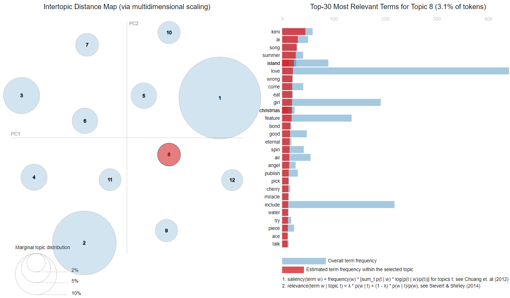

For LDA, for example, Topic 8 in the intertopic distance map included terms like "song," "summer," and "island," which do not share a coherent thematic meaning, making it difficult to derive a clear theme.

*Top terms for topic 5 by MNF*

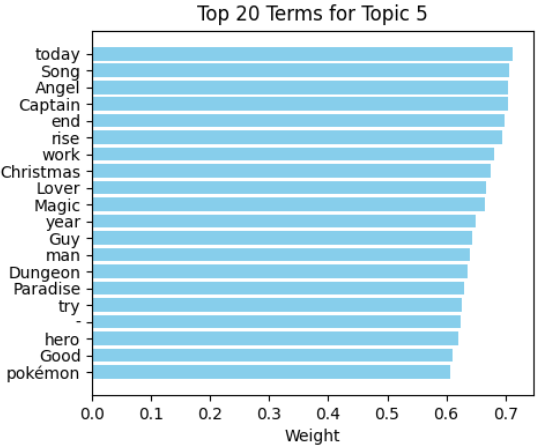

Similarly, with NMF, generic terms such as "today", and "end” appeared frequently in the top terms of Topics 5, which provided no significant insights into specific themes.

*Top terms for topic 0 and 1 by BERTopic*

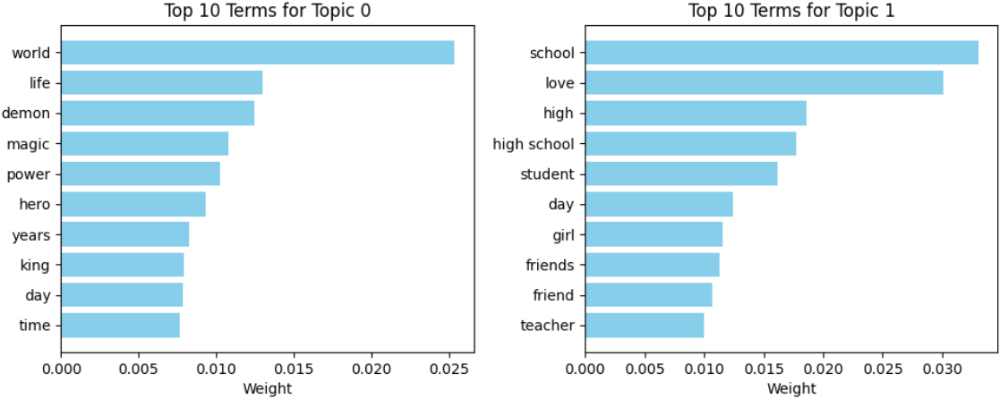

On the other hand, BERTopic performed significantly better. While there were still some generic terms present in the top terms, they were far fewer compared to LDA and NMF and generally had lower weights. For example, in the top terms for Topic 0 and 1, we observed that the five terms were thematically coherent and clearly represented related themes, making BERTopic the superior approach for our analysis.

Therefore, we **chose BERTopic as the final method** to derive thematic labels for the anime and manga titles, due to its ability to produce more consistent and interpretable thematic groupings.

#### Deep Dive into BERTopic

After selecting BERTopic as the most suitable method, we proceeded with an in-depth analysis involving both qualitative and quantitative evaluations to fine-tune the model's parameters for optimal performance. Our approach was twofold: first, to **qualitatively assess the configuration through manual evaluation**, and second, to **quantitatively fine-tune hyperparameters using an optimization strategy**.

1. **Qualitative Evaluation**

    Initially, we evaluated the quality of the topics generated by BERTopic by reviewing the top representative terms, the most confidently clustered titles, and the overall grouping results. This manual inspection provided us with insights into suitable configurations and helped in determining the following parameters:
    - **Clustering Algorithm:** KMeans for clustering the topics.
    - **Number of Topics:** 10 to 12, which strikes a balance between specificity and generalization.
    - **Tokenization:** A combination of unigrams and bigrams, to capture both individual words and frequent word pairs that convey meaningful information.
    - **Stop Words Expansion:** The stop words list was expanded based on results from previous topic modeling iterations to remove dominant but semantically meaningless words.
    - **Embedding Model:** `paraphrase-MiniLM-L12-v2`, well representing the themes of the dataset.

2. **Quantitative Fine-Tuning**

    Following the qualitative assessment, we start with the above configuration to perform a quantitative fine-tuning of other key hyperparameters. We utilized the `ParameterGrid` from Scikit-learn to systematically explore different values for critical hyperparameters, aiming to optimize the **average topic probability**. The parameters we fine-tuned included:
    - **n_neighbors:** Controls the number of nearest neighbors in clustering.
    - **min_dist:** Governs how tightly the points in the embedding space are packed.
    - **n_components:** Defines the dimensionality of the embeddings.
    - **n_clusters:** Specifies the number of clusters to be formed.

    The average topic probability was selected as the optimization metric over Silhouette scores because it directly represents the model's confidence in assigning a consistent theme to each anime or manga title. This metric aligns closely with our goal of deriving reliable thematic classifications. After running the optimization process, the best set of hyperparameters was found to be `{'min_dist': 0.2, 'n_clusters': 12, 'n_components': 2, 'n_neighbors': 15}` with **average topic probability of 0.29**.

### Results and Evaluation of Final Topic Model
#### Topic Assignments and Theme Labelling
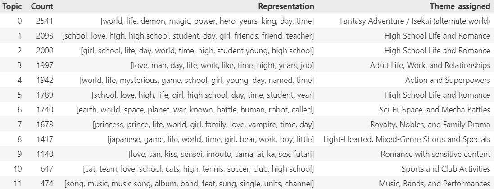

This table presents the count of documents in each topic along with the representative terms and our assigned the thematic labels based on these top terms.

We **grouped Topics 1, 2, and 5** into **'High School Life and Romance'** as they shared similar representative terms related to school and romantic relationships.

Some titles appear to be overlapping or misclustered between these topics, suggesting they represent similar content.

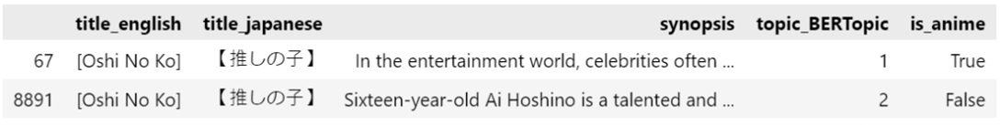

For example, the manga and anime versions of "Oshi No Ko" were clustered into topics 1 and 2 respectively, even though they are the same story.

#### Topic Distribution
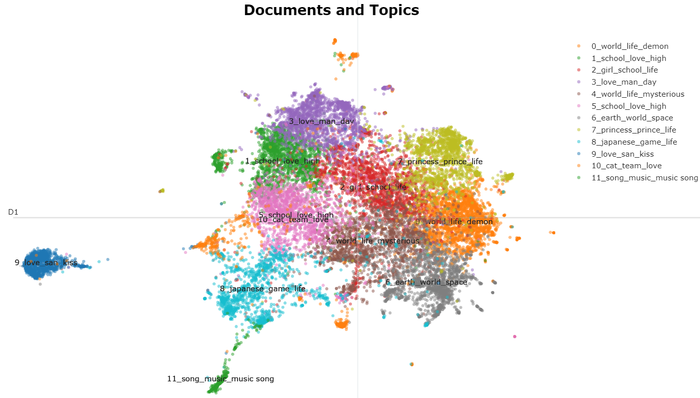

This figure shows the distribution of themes among anime and manga. Topics 1, 2, and 5 are closely located, further supporting our decision to group them into 'High School Life and Romance.' Another insight is the distinct separation of Topic 9, labeled as 'Romance with sensitive content,' which makes sense given the concentration of NSFW material. 

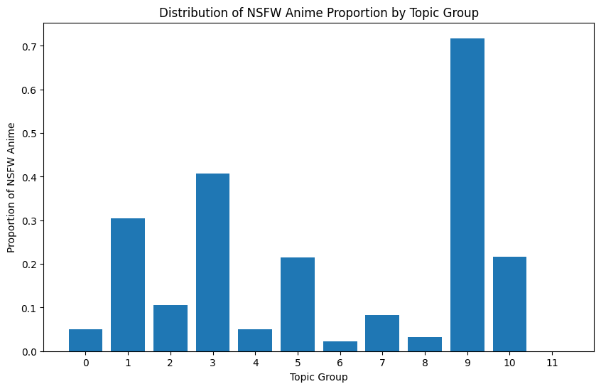

This was corroborated by this figure, which depicts the proportion of NSFW anime by topic group. Topic 9 has the highest NSFW proportion, while Topics 1 and 3 also exhibit    relatively high levels, as they relate to romance and adult relationships, which can include sensitive content.

#### Topic Scores Distribution
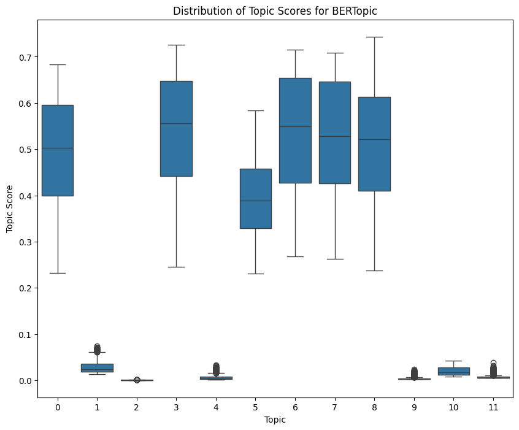

This figure provides the distribution of topic scores across different topics, showing the model's confidence in each prediction. It indicates that the model is less confident distinguishing between Topics 1 and 2, likely due to their thematic similarity. This is another reason we chose to group these topics together. The predictions for Topics 9, 10, and 11 also exhibit lower confidence, potentially due to a limited amount of similar content in those themes.

#### Sensitivity Analysis
We performed a simple sensitivity analysis by varying the random state of the model, including the UMAP and KMeans components. The results indicated significant variability compared to the original model, with differences observed in the number of topics generated. Some topics were either merged or split into new topics, and new themes also emerged. This suggests that the stability of the model is highly sensitive to the initialization conditions, indicating a lack of robustness in some cases. The variability observed in the sensitivity analysis highlights a potential area for improvement in future development, such as exploring techniques to stabilize the clustering process or adjusting hyperparameters to minimize the influence of random initialization.

In summary, the unsupervised learning section has successfully extracted thematic labels for anime and manga using **BERTopic**, which was determined to be the most suitable method **based on qualitative and quantitative evaluations**. The derived themes provide a comprehensive and interpretable categorization that can be further utilized for analysis. Importantly, the thematic labels obtained from this topic modeling will serve as an additional feature in the supervised learning section to enhance the score prediction.

## Supervised Learning
After exploring various models, including Support Vector Machines (SVM) and tree-based models, we ultimately chose a deep learning approach for the prediction task. Our motivation for this choice was driven by the need to capture complex, non-linear relationships between features that simpler models struggled with. The flexibility and scalability of neural networks made them a more suitable candidate for effectively handling the diverse feature types and the large volume of data available.

### Methodology
In the supervised learning stage, we aimed to predict the user scores from MyAnimeList using a neural network model. The dataset consists of four types of columns: **single categorical**, **multi-label categorical**, **numerical**, and **Boolean**. During pre-processing, we used **label encoding** for both single and multi-label categorical columns. Label encoding is preferable for deep learning since it allows the model to handle categorical features effectively, whereas one-hot encoding would significantly increase dimensionality. To manage the variable length sequences in the multi_cat columns, we applied zero-padding, which ensures a consistent sequence length across different columns. We also included an additional dimension for an 'Unknown' label to handle unseen labels in the test set. These categorical columns were then passed through an embedding layer in the model.

The model itself is a custom neural network implemented in PyTorch. It contains several components to process different feature types:
- **Embedding Layers:** Used for single categorical and multi-categorical features, each column was assigned an embedding layer to transform categorical indices into dense vector representations.
- **Dense Layers for Numeric and Boolean Features:** Numeric and Boolean features were processed using fully connected layers that transformed them into the same dimensionality as the embedded categorical features.
- **Fully Connected Layers:** These layers combined all features—categorical embeddings, numerical, and Boolean—to create a unified representation. Multiple fully connected layers with specified hidden sizes were employed, followed by dropout layers for regularization.
- **Output Layer:** A final dense layer was used to output a single value for the regression task, predicting the user score.

#### Model Training and Fine-Tuning
The model was trained using a training loop that incorporated several key techniques to improve performance and ensure robustness:
- **Cross-Validation:** We used 5-fold cross-validation with the KFold method from Scikit-learn. This helped in evaluating the model across different subsets of the data, thus reducing overfitting.
- **Hyperparameter Tuning with Optuna:** We used Optuna, a hyperparameter optimization framework, to fine-tune six key hyperparameters of the model: embedding dimension, number of layers, hidden sizes, learning rate, batch size, and dropout rate. Optuna conducted 30 trials to find the optimal set of hyperparameters.
- **Batching and Data Loading:** We used a DataLoader to create mini-batches for training, with the batch size being one of the parameters fine-tuned by Optuna. Training in batches allows for efficient gradient updates and memory usage, particularly when working with large datasets.
- **Early Stopping:** During training, early stopping was employed to prevent overfitting. If the validation loss did not improve for three consecutive epochs, training was stopped early. This technique helps maintain model quality without unnecessarily increasing training time.

#### Summary of Training Procedure
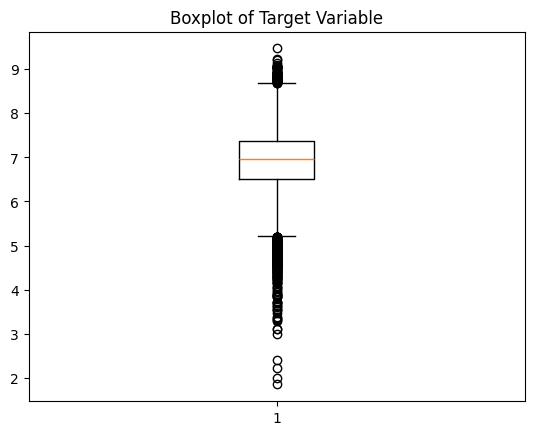

As shown this figure, the target variable (score) distribution does not exhibit too many outliers, leading us to choose to minimize the Mean Squared Error (MSE) as our loss function. MSE is particularly effective when dealing with relatively normal distributions and few extreme values, making it suitable for our score prediction task.

The model training loop included an alternating schedule between the training and validation phases for each fold. During training, the mean squared error (MSE) loss function was minimized using the Adam optimizer. For each batch, we performed a forward pass through the model, computed the loss, performed backpropagation, and updated the weights accordingly. Validation was performed after each epoch, and the best model state was saved if the validation loss improved.

Once all folds were completed, the best-performing model based on validation loss was selected, and its state was saved for later evaluation.

### Evaluation
We finally obtained the following result from the best trial:
- Best Trial Results: `MSE Mean = 0.362, MSE SD = 0.012, RMSE Mean = 0.601, RMSE SD = 0.010`.
- Hyperparameters: `Embedding Dim = 10, Layers = 2, Hidden Sizes = [123, 96], LR = 0.00387, Batch Size = 64, Dropout Rate = 0.206`

- Test Set Results:
    - Test MSE: 0.397
    - Test RMSE: 0.630

The evaluation metrics indicate that our model performed well on both the training and test sets, with an RMSE of approximately 0.630 on the test set, demonstrating a good fit for predicting user scores.

#### Feature Analysis
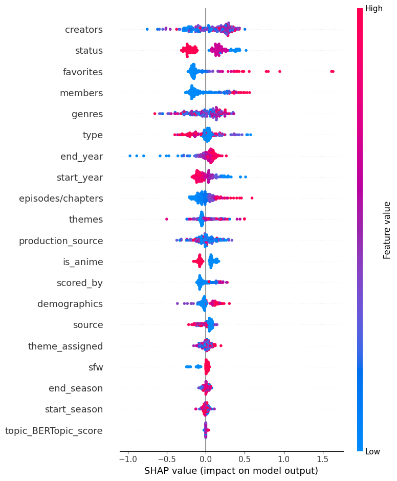

This figure presents the SHAP summary plot, which provides a comprehensive visualization of the impact of each feature on the model's predictions for user scores. The plot reveals several key insights regarding how different features influence the model's output:

- **Creators:** Creators is the most influential feature in the model, despite being a multi-categorical variable with numerous unique values, making it harder to interpret directly. Its high importance suggests that the reputation, skills, or popularity of the creators play a significant role in shaping user perceptions and ratings. This finding emphasizes the critical role of creative talent in the success of anime and manga titles.

- **Status:** Status emerges as second most important factors. Titles with an unknown status (depicted by the red points, which represent higher feature values) tend to have a highly negative association with user scores. This suggests that when the status of an anime or manga is unclear, users may perceive it less favorably, possibly due to concerns about its completeness or quality.

- **Popularity Features:** The features favorites, members, and scored_by are highly influential, with a generally positive impact on user scores. These features, which are directly related to the popularity of a title, indicate that higher popularity often corresponds to higher user ratings. Popular titles tend to be well-received, perhaps benefiting from a broader fan base and higher levels of engagement.

- **Non-linear Impact of Categorical Features:** Categorical features such as creators, genres, and production_source show mixed effects, represented by both positive and negative SHAP values. This indicates that these features have a non-linear relationship with user scores. Their impact likely depends on the combination with other features; for instance, certain genres may be rated more favorably when paired with a popular creator or production source, while others may be less well-received.

- **Episodes/Chapters:** Episodes/chapters also show a positive relationship with user scores. Titles with more episodes or chapters are generally rated higher. It is indicative of a trend where more established, well-received content has the demand to continue for more extended periods, thus garnering higher user appreciation.

- **Start and End Year:** Start year and end year features have an interesting relationship with user scores. Titles with earlier start years tend to have higher scores, potentially due to nostalgia or the perception of these titles as classics. Additionally, titles with later end years may also receive higher scores, possibly reflecting improved quality or the effect of ongoing relevance in the media landscape.

- **Manga vs. Anime:** The is_anime feature reveals that manga generally tends to receive slightly higher scores compared to anime. This may be due to some anime being adaptations of other sources, including manga. These adaptations face the challenge of meeting audience expectations from the original source while also restructuring the story to fit the anime format, which can be difficult and may lead to lower ratings if not done successfully.

- **Safe for Work (SFW) Feature:** The sfw feature indicates that NSFW content has a slightly negative impact on user scores. This could reflect a general preference for more family-friendly content among the broader user base.

In summary, the SHAP summary plot highlights that while creators and popularity is a major driver of user scores, categorical features exhibit complex, non-linear interactions that significantly affect ratings. These insights illustrate the advantage of machine learning models in capturing subtle patterns in data, where traditional linear approaches might fail to account for such intricate dependencies.

#### Learning Curve Analysis
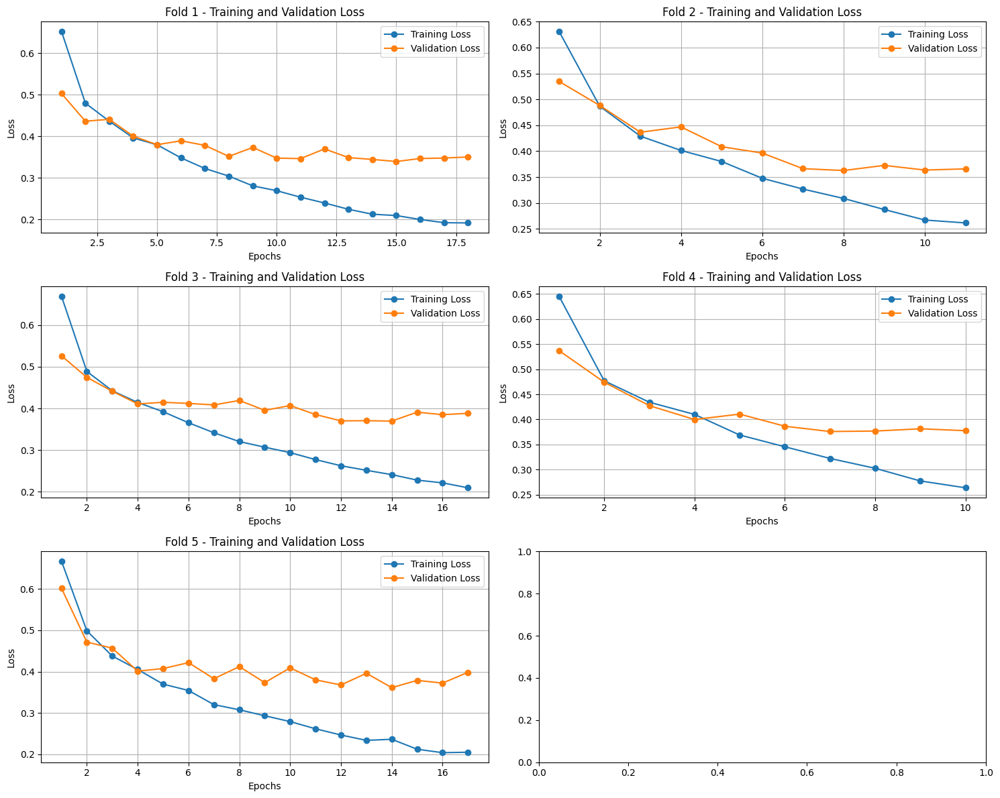

This is the learning curves for the training and validation losses across all 5 folds. It shows a steady decrease in both training and validation losses, indicating that the model was learning effectively during each fold. The training and validation losses were close to each other throughout, suggesting that the model had a good fit and did not suffer from significant overfitting.

Early stopping was applied when the validation loss did not improve for 3 consecutive epochs. When early stopping was triggered, the model's state was reverted to the epoch with the lowest validation loss within those 3 epochs, ensuring that the best possible model was retained. This can be observed in the learning curves, where the validation loss stabilizes after reaching its optimal value, preventing overfitting.

The consistent behavior across folds indicates that our model was robust and able to generalize well across different subsets of the dataset.

#### Hyperparameter Sensitivity Analysis
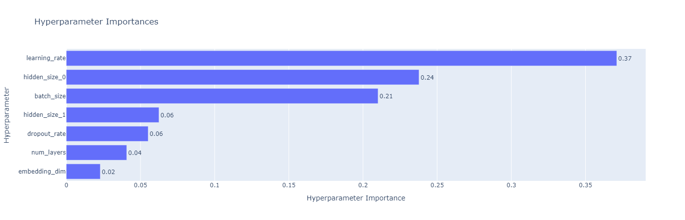

This figure presents the hyperparameter importance graph generated by Optuna, which shows the sensitivity of the model to different hyperparameters. The results indicate that `learning_rate` has the highest importance, accounting for 37% of the impact on the model's performance. This highlights the critical role that an appropriate learning rate plays in achieving effective convergence and minimizing loss.

The second most important hyperparameter is `hidden_size_0`, contributing 24% to the overall performance. This underscores the significance of selecting an optimal hidden layer size to ensure that the model is capable of capturing complex patterns in the data. Additionally, `batch_size` contributes 21%, which is also substantial, indicating that the way data is batched significantly affects training efficiency and model performance.

Other hyperparameters such as `hidden_size_1` and `dropout_rate` each contribute around 6%, suggesting their moderate influence on the model's ability to generalize and avoid overfitting. `num_layers` and `embedding_dim` contribute less, with values of 4% and 2% respectively, implying a comparatively lower impact on performance. However, these parameters still play a role in ensuring that the model has enough depth and capacity to learn adequately.

#### Residual Analysis
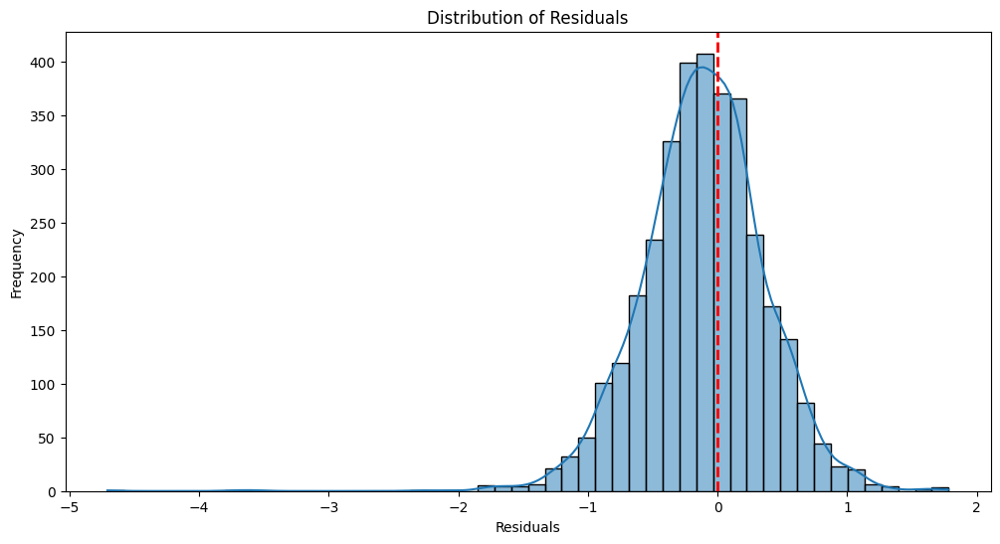

This figure presents the distribution of residuals for the model's predictions on the test set. The residuals are centered around zero, indicating that there is no significant bias in the model's predictions. The distribution is approximately normal, suggesting that the model is well-calibrated, with no systematic over-prediction or under-prediction.

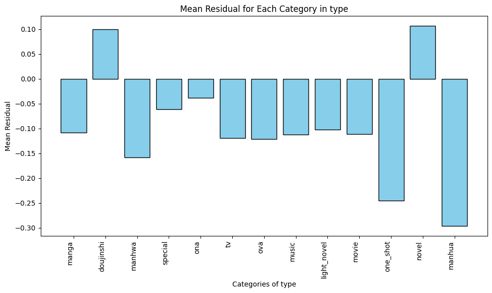

This figure shows the mean residual for each category in the type feature. Notably, the manhua and one_shot categories exhibit significantly larger residual errors compared to other types. This could be attributed to the limited number of data points for these categories, making it challenging for the model to accurately capture the relationship between these types and the target score.

## Discussion
### Supervised Learning
From the supervised learning process, we discovered that popularity-related features (e.g., members, favorites, scored_by) generally have a positive influence on user scores, suggesting that popular titles are more likely to receive higher ratings due to greater audience engagement. Additionally, creators emerged as the most influential feature, highlighting the significant role of creative talent in driving user appreciation. Most of these findings align well with our expectations, especially regarding the positive influence of popularity and the importance of creators.

A key challenge encountered during this process was the use of embedding layers for categorical columns, particularly for the multi-cat columns. Handling variable-length sequences and representing them effectively for model input was a complex task. We responded by implementing zero-padding and designing embeddings to handle both the known and unknown values within the sequences, which provided a feasible solution. However, fine-tuning the embedding layer for these categorical features was particularly difficult and required careful experimentation.

With additional time and resources, a promising extension would be to explore more sophisticated techniques for handling categorical columns. This could involve using transformer-based embeddings, where the self-attention mechanism can effectively capture relationships between categorical values, or leveraging hybrid approaches that combine learned embeddings with feature engineering, particularly for columns with many unique values or highly variable lengths. The self-attention mechanism, in particular, could offer an advanced way to capture intricate interactions and dependencies that were difficult to model with conventional embeddings.

### Unsupervised Learning
The unsupervised learning portion of the project provided insightful findings regarding the themes derived from anime and manga titles. One particularly surprising result was the high representation of themes like 'High School Life and Romance' and 'Fantasy Adventure / Isekai (alternate world)'. While we expected these to be common themes, their overwhelming presence indicated their dominance in anime and manga culture.

One of the main challenges we faced was manually interpreting the topics derived from the models and ensuring the cluster results were meaningful. This process was often subjective and required significant domain knowledge to identify coherent themes. To overcome this, we iteratively refined our custom stop-word lists and experimented with different topic modeling configurations until the clusters began to make intuitive sense.

To further improve the robustness of our topic modeling results, an important area of focus should be reducing the sensitivity and randomness inherent in the current approach. The topic modeling results were sometimes unstable, heavily influenced by the random initialization of models. Future work could involve employing ensemble approaches that aggregate the outcomes of multiple runs, thereby reducing the variability of the themes produced. Additionally, methods such as consensus clustering could be explored to ensure more stable and reproducible results. Reducing this randomness would ultimately make the derived themes more reliable and applicable for downstream analyses.

## Repository Overview
This repository contains three Jupyter notebooks:

- `data_preprocessing.ipynb`: Handles the initial data cleaning, transformation, and feature engineering.
- `nlp_and_topic_modeling.ipynb`: Implements natural language processing and topic modeling techniques to derive meaningful themes from anime and manga titles.
- `deep_learning.ipynb`: Contains the supervised learning models used to predict user scores, including the pre-processing, architecture and training process of a deep learning model.

Intermediate outputs generated from each notebook are saved in the `assets` folder in `.joblib` format for convenient reuse across notebooks. The original data source is also stored in the `assets` folder in `.csv` format.

To replicate the analysis, please ensure that you install all necessary libraries by running `pip install -r requirements.txt`. Note that some randomness is involved in certain steps, especially in the topic modeling and deep learning training processes, which means your results may not exactly match the ones reported in the documentation.
