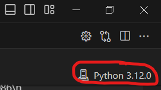
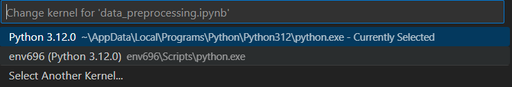
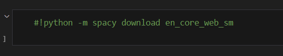
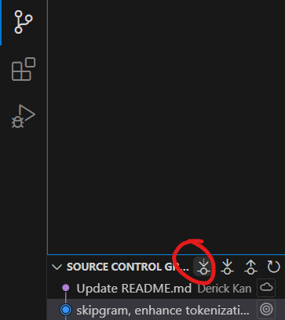
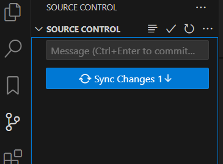
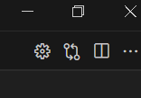
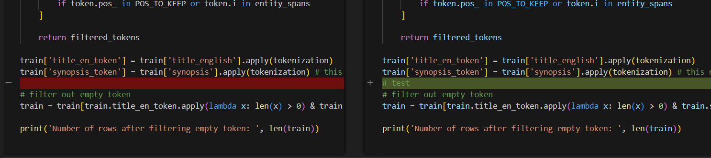
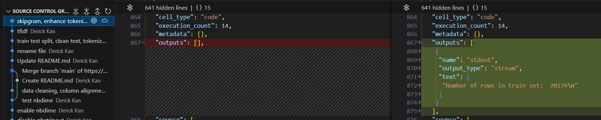
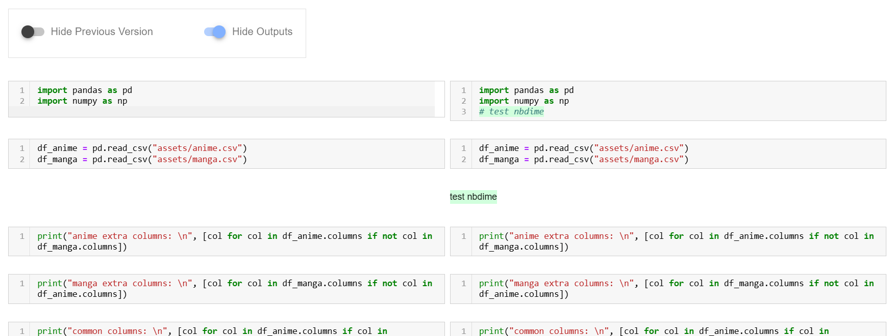

# Virtual Environment Setup Guide

This guide explains how to set up a virtual environment, install necessary libraries, and keep the environment up to date using `requirements.txt`.

## **1. Initial Setup**

### 1.1 Create the Virtual Environment
In VS code, press ctrl + ` to open a terminal. Make sure you are in your project directory.

Run:
```bash
python -m venv env696
```
### 1.2 Activate the Virtual Environment
```bash
env696\Scripts\activate
```
### 1.3 Install Required Libraries
Use the requirements.txt file to install libraries:
```bash
pip install -r requirements.txt
```
## **2. Working with the Virtual Environment in VScode Jupyter**
### 2.1 Every Time You Start Working
Activate the virtual environment in VScode jupyter:

Press this button:



Change to `env696`:



Verify activation by running this in jupyter:
```bash
!where python
```
The first path should be within `env696`.
### 2.2 When There Are Changes to `requirements.txt`
Run:
```bash
pip install -r requirements.txt
```

### 2.3 Every Time You Install or Update a Library
Export to the `requirements.txt`:
```bash
pip freeze > requirements.txt
```
If your code require downloaded model, add the download command near that block.


## 3. Notes
`env696` folder is created under the project folder, but it will not upload to github, as I include `.gitignore` to tell git to ignore this folder.

If you encounter any issues or want to start fresh:
1. Manually delete the `env696` folder.
2. Recreate the environment by following step 1 again.

# Project Timeline

Ideally, the tasks with same stage can be done parallel.

| Stage | Task | Assign to |
| --- | --- | --- |
| 1 | Data cleaning, merging | Derick |
| 2 | Text processing | Derick |
| 2 | Normalization, One hot encoding, format consistent | Hinson |
| 3 | Topic modeling | Derick |
| 3 | Clustering | Hinson |
| 4 | Interpret topic modelling result | Both |
| 5 | Clustering (continue with topic modelling result) | Hinson |
| 6 | Predict popularity, score (traditional model) | Hinson |
| 6 | Predict popularity, score (deep learning) | Derick |
| 7 | Compare model and extract feature importance | Both |
| 7 | Forecast trend | if time sufficient |

### How to get update from github

click the fetch button



A new commit will show up in the source control graph if it has new update.

Then, click sync change.




### How to view diffs

- view diffs for current commit (before you push):
  
  In VScode, save the notebook and click the arrow surround button
  
  
  
  

- view diffs for all previous commit:
  
  VScode don't have good support for viewing jupyter diffs 
  

  So, use third party website, provide user friendly view:
  https://app.reviewnb.com/derickkan3356/696/
  


